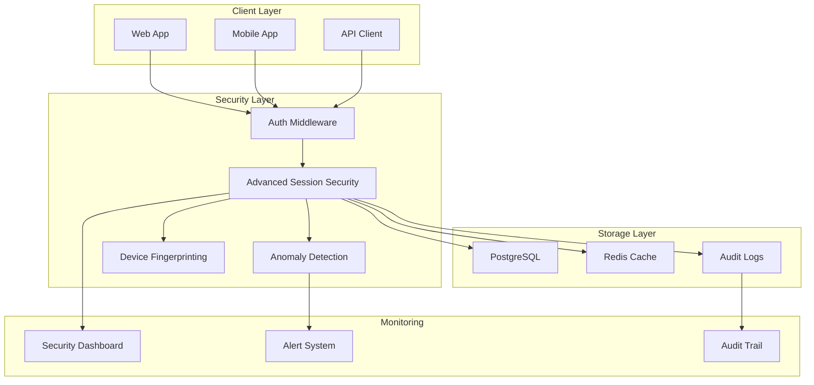

# Security Design - Advanced Session Security

## Overview

Truxe implements enterprise-grade session security with comprehensive threat detection, device tracking, and automated response mechanisms. This document outlines the advanced security features implemented in W3.1.

## Architecture



## Core Security Features

### 1. JTI-Based Token Revocation

#### Implementation
- **Immediate Revocation**: Tokens can be invalidated instantly using JWT ID (JTI) blacklisting
- **Redis Storage**: Blacklisted JTIs stored in Redis with configurable TTL (default: 30 days)
- **Atomic Operations**: All blacklist operations use Redis pipelines for consistency
- **Audit Trail**: Every revocation is logged with context and reason

#### Usage
```javascript
// Blacklist a JTI
await advancedSessionSecurityService.blacklistJTI(jti, 'security_violation', {
  adminId: 'admin-user-id',
  reason: 'Suspicious activity detected'
})

// Check if JTI is blacklisted
const status = await advancedSessionSecurityService.isJTIBlacklisted(jti)
if (status.blacklisted) {
  // Token is revoked, deny access
}
```

#### Performance
- **Lookup Speed**: O(1) Redis lookup for blacklist checks
- **Memory Efficient**: Configurable TTL prevents unlimited growth
- **Scalable**: Supports millions of blacklisted tokens

### 2. Advanced Device Fingerprinting

#### Comprehensive Data Collection
- **Browser Information**: Name, version, engine (Blink, Gecko, WebKit)
- **Operating System**: Name, version, architecture
- **Device Type**: Desktop, mobile, tablet detection
- **Network Information**: IP address, headers analysis
- **Behavioral Patterns**: Request timing, usage patterns

#### Fingerprint Generation
```javascript
const deviceInfo = advancedSessionSecurityService.generateAdvancedDeviceFingerprint(request, {
  customData: 'additional-context'
})

// Returns:
// {
//   fingerprint: 'sha256-hash-of-all-data',
//   stableFingerprint: 'sha256-hash-of-stable-data',
//   browser: { name: 'Chrome', version: '120.0.0.0', engine: 'Blink' },
//   os: { name: 'macOS', version: '14.0', architecture: 'arm64' },
//   device: { type: 'Desktop', model: 'Unknown', vendor: 'Apple' },
//   ip: '192.168.1.100',
//   generatedAt: '2024-01-15T10:30:00Z'
// }
```

#### Device Recognition
- **Stable Fingerprints**: Focus on non-volatile device characteristics
- **Recognition Threshold**: Configurable similarity scoring
- **New Device Alerts**: Automatic notifications for unrecognized devices

### 3. Concurrent Session Management

#### Priority-Based Eviction
When session limits are exceeded, the system uses a scoring algorithm to determine which sessions to revoke:

```javascript
// Session scoring factors
const score = 
  (ageHours * 10) +                    // Age penalty
  (inactiveHours * 20) +               // Inactivity penalty
  (sameDevice ? 5000 : 0) +            // Same device bonus
  (sameBrowser ? 1000 : 0) +           // Same browser bonus
  (sameOS ? 500 : 0) +                 // Same OS bonus
  (sameIP ? 2000 : 0)                  // Same IP bonus
```

#### Configuration
```bash
# Environment variables
MAX_CONCURRENT_SESSIONS=5
SESSION_SCORING_AGE_WEIGHT=10
SESSION_SCORING_INACTIVITY_WEIGHT=20
SESSION_SCORING_SAME_DEVICE_BONUS=5000
SESSION_SCORING_SAME_BROWSER_BONUS=1000
SESSION_SCORING_SAME_OS_BONUS=500
SESSION_SCORING_SAME_IP_BONUS=2000
```

#### Benefits
- **User Experience**: Preserves sessions on familiar devices
- **Security**: Automatically removes suspicious or inactive sessions
- **Fairness**: Considers multiple factors for eviction decisions

### 4. Anomaly Detection

#### Impossible Travel Detection
Detects when a user appears to travel at physically impossible speeds:

```javascript
const travelAnalysis = await advancedSessionSecurityService.detectImpossibleTravel(
  userId,
  { ip: currentIP },
  new Date()
)

if (travelAnalysis.impossibleTravel) {
  // Alert: User appeared to travel 3000km in 30 minutes
  await logSecurityEvent({
    action: 'session.impossible_travel_detected',
    severity: 'high',
    details: travelAnalysis
  })
}
```

#### Configuration
- **Threshold**: Default 500 km/h (configurable)
- **Time Window**: Minimum 1 hour between sessions
- **Location Service**: Integrates with IP geolocation APIs

#### Suspicious Pattern Detection
Identifies unusual session creation patterns:

- **Rapid Multi-IP Sessions**: Multiple sessions from different IPs within short timeframe
- **Browser/OS Anomalies**: Unusual combinations or excessive variety
- **Behavioral Changes**: Deviation from normal usage patterns

#### Risk Scoring
```javascript
// Risk levels
const riskScore = patterns.reduce((score, pattern) => {
  switch (pattern.severity) {
    case 'low': return score + 10
    case 'medium': return score + 25
    case 'high': return score + 50
    case 'critical': return score + 100
    default: return score
  }
}, 0)

// Actions based on risk score
if (riskScore > 75) {
  // High risk - require additional verification
} else if (riskScore > 50) {
  // Medium risk - log and monitor
} else if (riskScore > 25) {
  // Low risk - log only
}
```

### 5. Comprehensive Audit Logging

#### Structured Event Logging
All security events are logged with consistent structure:

```javascript
{
  "id": "log-entry-id",
  "timestamp": "2024-01-15T10:30:00Z",
  "userId": "user-uuid",
  "orgId": "org-uuid",
  "action": "session.created",
  "target": { "type": "session", "id": "session-jti" },
  "severity": "info",
  "ip": "192.168.1.100",
  "userAgent": "Mozilla/5.0...",
  "deviceInfo": { ... },
  "correlationId": "correlation-uuid",
  "details": {
    "deviceRecognized": false,
    "impossibleTravel": false,
    "suspiciousActivity": false,
    "riskScore": 15
  }
}
```

#### Security Events Tracked
- **Authentication Events**: Login, logout, token refresh
- **Session Management**: Creation, revocation, expiration
- **Security Violations**: Impossible travel, suspicious patterns
- **Administrative Actions**: Session revocation, blacklist management
- **System Events**: Cleanup operations, anomaly detection

#### Dual Storage
- **PostgreSQL**: Persistent storage for compliance and analysis
- **Redis**: Real-time event cache for monitoring dashboards

### 6. Session Cleanup Automation

#### Background Processing
Automated cleanup runs on configurable intervals:

```javascript
// Cleanup operations
setInterval(async () => {
  const stats = await performCleanup()
  console.log('Cleanup completed:', stats)
}, cleanupInterval)
```

#### Cleanup Operations
1. **Expired Sessions**: Remove sessions expired > 7 days
2. **Blacklisted JTIs**: Clean up expired blacklist entries
3. **Security Events**: Archive old events from Redis cache
4. **Audit Logs**: Optional archival of old audit entries

#### Performance Monitoring
- **Cleanup Duration**: Track time taken for cleanup operations
- **Items Processed**: Count of cleaned up items
- **Error Handling**: Graceful handling of cleanup failures

## Security Monitoring Dashboard

### Real-Time Metrics
- **Active Sessions**: Current active session count
- **Security Events**: Recent security event timeline
- **Threat Detection**: Anomaly detection alerts
- **Device Statistics**: Browser/OS distribution

### API Endpoints

#### Dashboard Data
```bash
GET /security/dashboard?timeRange=24h
```

#### Session Management
```bash
GET /security/sessions?userId=uuid&status=active&limit=100
POST /security/revoke
```

#### JTI Blacklist Management
```bash
POST /security/blacklist
{
  "action": "add|remove|check",
  "jti": "jwt-id",
  "reason": "security_violation"
}
```

#### Security Events
```bash
GET /security/events?severity=high&hours=24&limit=100
```

#### Health Status
```bash
GET /security/health
```

### Dashboard Features
- **Time Range Filtering**: 1h, 24h, 7d views
- **Real-Time Updates**: WebSocket-based live updates
- **Alert Management**: Severity-based filtering and notifications
- **Export Capabilities**: CSV/JSON export for compliance

## Configuration

### Environment Variables

#### Core Security Settings
```bash
# Session Management
MAX_CONCURRENT_SESSIONS=5
SESSION_CLEANUP_INTERVAL=3600000  # 1 hour in ms
ENABLE_DEVICE_TRACKING=true
SESSION_EXTEND_ON_USE=true

# Advanced Security
ENABLE_ANOMALY_DETECTION=true
IMPOSSIBLE_TRAVEL_THRESHOLD_KMH=500
ENABLE_NEW_DEVICE_NOTIFICATION=true
JTI_BLACKLIST_TTL=2592000000  # 30 days in ms

# Session Scoring Weights
SESSION_SCORING_AGE_WEIGHT=10
SESSION_SCORING_INACTIVITY_WEIGHT=20
SESSION_SCORING_SAME_DEVICE_BONUS=5000
SESSION_SCORING_SAME_BROWSER_BONUS=1000
SESSION_SCORING_SAME_OS_BONUS=500
SESSION_SCORING_SAME_IP_BONUS=2000
```

#### Redis Configuration
```bash
REDIS_URL=redis://localhost:6379
REDIS_KEY_PREFIX=truxe:
REDIS_RETRY_DELAY=100
REDIS_MAX_RETRIES=3
```

### Production Recommendations

#### Performance Settings
```bash
# High-throughput environments
MAX_CONCURRENT_SESSIONS=10
SESSION_CLEANUP_INTERVAL=1800000  # 30 minutes
JTI_BLACKLIST_TTL=604800000      # 7 days

# Memory optimization
REDIS_KEY_PREFIX=truxe:prod:
```

#### Security Hardening
```bash
# Strict security
IMPOSSIBLE_TRAVEL_THRESHOLD_KMH=300
ENABLE_ANOMALY_DETECTION=true
ENABLE_NEW_DEVICE_NOTIFICATION=true

# Aggressive session management
MAX_CONCURRENT_SESSIONS=3
SESSION_SCORING_INACTIVITY_WEIGHT=50
```

## Security Best Practices

### 1. Token Management
- **Short-Lived Access Tokens**: 15-minute default expiration
- **Secure Refresh Rotation**: New refresh token on each use
- **Immediate Revocation**: JTI blacklisting for instant invalidation

### 2. Device Trust
- **Progressive Trust**: Build trust over time with consistent device usage
- **Anomaly Thresholds**: Adjust detection sensitivity based on user behavior
- **User Education**: Notify users about new device logins

### 3. Monitoring and Alerting
- **Real-Time Dashboards**: Monitor security events as they happen
- **Automated Responses**: Configure automatic actions for high-risk events
- **Compliance Logging**: Maintain detailed audit trails

### 4. Privacy Considerations
- **Data Minimization**: Collect only necessary device information
- **IP Masking**: Partially mask IP addresses in logs and dashboards
- **Retention Policies**: Implement data retention and deletion policies

### 5. Performance Optimization
- **Redis Clustering**: Scale Redis for high-throughput environments
- **Database Indexing**: Optimize queries with proper indexes
- **Async Processing**: Use background jobs for non-critical operations

## Incident Response

### Security Event Severity Levels

#### Critical (Score: 90-100)
- **Impossible Travel**: >1000 km/h travel speed
- **Mass Session Creation**: >20 sessions in 5 minutes
- **Known Attack Patterns**: Matching threat intelligence

**Response**: Immediate session revocation, user notification, security team alert

#### High (Score: 70-89)
- **Impossible Travel**: 500-1000 km/h travel speed
- **Suspicious Patterns**: Multiple risk factors combined
- **Unusual Device Changes**: Completely different device profile

**Response**: Additional verification required, security team notification

#### Medium (Score: 40-69)
- **New Device**: Unrecognized device login
- **Geographic Anomaly**: Unusual but possible location change
- **Session Limit**: Approaching concurrent session limits

**Response**: User notification, enhanced monitoring

#### Low (Score: 10-39)
- **Browser Change**: Different browser on same device
- **IP Change**: Different IP in same geographic area
- **Normal Patterns**: Standard usage variations

**Response**: Log for analysis, no immediate action

### Automated Response Actions

#### Session Revocation
```javascript
if (riskScore >= 90) {
  // Revoke all user sessions
  await revokeAllUserSessions(userId, 'high_risk_detected')
  await notifySecurityTeam('critical', event)
} else if (riskScore >= 70) {
  // Revoke current session only
  await revokeSession(sessionId, 'medium_risk_detected')
  await requireAdditionalVerification(userId)
}
```

#### User Notifications
```javascript
if (newDevice && !deviceRecognized) {
  await sendNewDeviceNotification(user.email, {
    device: deviceInfo,
    location: locationInfo,
    timestamp: new Date(),
    actionUrl: `${baseUrl}/security/devices`
  })
}
```

### Manual Response Procedures

#### Investigation Steps
1. **Event Analysis**: Review security event details and context
2. **User Verification**: Contact user through verified channels
3. **Session Review**: Examine all recent sessions and activities
4. **Device Analysis**: Compare device fingerprints and patterns
5. **Geographic Analysis**: Validate location changes and travel patterns

#### Response Actions
1. **Session Management**: Revoke suspicious sessions
2. **Account Security**: Require password reset or MFA setup
3. **Monitoring Enhancement**: Increase monitoring for affected user
4. **Documentation**: Record incident details and response actions

## Integration Guide

### Middleware Integration
```javascript
// Enhanced authentication middleware
fastify.decorate('authenticate', async function (request, reply) {
  // Standard JWT verification
  const verification = await jwtService.verifyAccessToken(token)
  
  // Advanced security checks
  const blacklistCheck = await advancedSessionSecurityService.isJTIBlacklisted(verification.jti)
  if (blacklistCheck.blacklisted) {
    return reply.code(401).send({ error: 'Token revoked' })
  }
  
  // Update session activity
  await sessionService.updateSessionLastUsed(verification.jti)
})
```

### Route Protection
```javascript
// Require additional verification for high-risk sessions
fastify.get('/sensitive-endpoint', {
  preHandler: [
    fastify.authenticate,
    async (request, reply) => {
      const riskScore = await calculateSessionRisk(request.session)
      if (riskScore > 50) {
        return reply.code(403).send({ 
          error: 'Additional verification required',
          verificationUrl: '/auth/verify-identity'
        })
      }
    }
  ]
}, handler)
```

### Event Handling
```javascript
// Custom event handlers
advancedSessionSecurityService.on('impossibleTravel', async (event) => {
  await notifySecurityTeam(event)
  await requireUserVerification(event.userId)
})

advancedSessionSecurityService.on('newDevice', async (event) => {
  await sendNewDeviceEmail(event.user.email, event.deviceInfo)
})
```

## Performance Metrics

### Target Performance
- **JTI Lookup**: <5ms (95th percentile)
- **Device Fingerprinting**: <50ms (95th percentile)
- **Anomaly Detection**: <100ms (95th percentile)
- **Session Cleanup**: <30 seconds for 100k sessions
- **Dashboard Load**: <2 seconds for 24h data

### Monitoring Metrics
```javascript
// Key performance indicators
{
  "security_events_per_second": 1000,
  "jti_blacklist_size": 50000,
  "active_sessions": 25000,
  "anomaly_detection_latency_p95": 85,
  "cleanup_duration_seconds": 15
}
```

### Scaling Considerations
- **Redis Clustering**: For >100k blacklisted JTIs
- **Database Partitioning**: For >10M audit log entries
- **Background Processing**: Separate workers for cleanup and analysis
- **CDN Integration**: Geographically distributed security checks

## Compliance and Auditing

### Regulatory Compliance
- **GDPR**: Data retention policies, user consent, right to deletion
- **SOX**: Financial controls, audit trail integrity
- **HIPAA**: Healthcare data protection, access controls
- **PCI DSS**: Payment card industry security standards

### Audit Trail Requirements
- **Immutable Logs**: Append-only audit log structure
- **Complete Coverage**: All security events logged
- **Tamper Evidence**: Cryptographic integrity checks
- **Long-Term Retention**: Configurable retention periods

### Reporting Capabilities
- **Security Reports**: Daily, weekly, monthly summaries
- **Incident Reports**: Detailed analysis of security events
- **Compliance Reports**: Regulatory requirement fulfillment
- **Performance Reports**: System performance and availability

This comprehensive security design ensures that Truxe provides enterprise-grade session security while maintaining high performance and usability.
