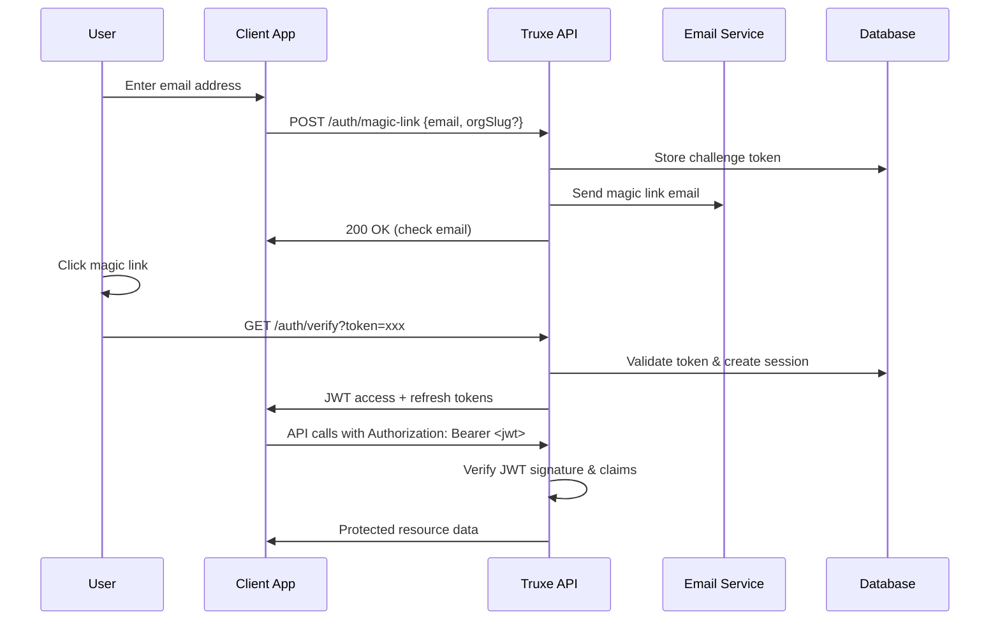

# ADR-002: Authentication Strategy

**Status:** Accepted  
**Date:** 2024-01-15  
**Deciders:** Core Team  

## Context

Truxe needs a secure, user-friendly authentication strategy that balances security, usability, and implementation complexity. The strategy must support:

- Passwordless authentication (primary)
- Multi-factor authentication (future)
- Session management with revocation
- Multi-tenant token claims
- Compliance with modern security standards

## Decision

We will implement a **passwordless-first authentication strategy** using:

1. **Email Magic Links** as the primary authentication method
2. **JWT with refresh token rotation** for session management
3. **JWKS endpoint** for public key distribution
4. **JTI-based revocation** for immediate token invalidation

## Authentication Flow

### Magic Link Flow


### Token Structure

#### Access Token (Short-lived: 15 minutes)
```typescript
interface AccessTokenPayload {
  // Standard JWT claims
  iss: string;           // "https://auth.yourapp.com"
  sub: string;           // User ID
  aud: string;           // Client application
  exp: number;           // Expiration timestamp
  iat: number;           // Issued at timestamp
  jti: string;           // JWT ID for revocation
  
  // Truxe-specific claims
  email: string;
  email_verified: boolean;
  
  // Multi-tenant claims (when applicable)
  org_id?: string;       // Current organization
  org_slug?: string;     // Organization slug
  role?: string;         // Role in current org
  permissions?: string[]; // Granular permissions
}
```

#### Refresh Token (Long-lived: 30 days)
```typescript
interface RefreshTokenPayload {
  iss: string;
  sub: string;           // User ID
  jti: string;           // Links to sessions table
  exp: number;           // 30 days from issue
  type: 'refresh';
  device_id?: string;    // Device fingerprint
}
```

## Rationale

### Why Passwordless (Magic Links)?

#### ✅ Advantages
1. **Security:** No password to steal, phish, or reuse
2. **User Experience:** No password to remember or reset
3. **Implementation:** Simpler than password + reset flows
4. **Compliance:** Reduces password-related compliance requirements
5. **Accessibility:** Works for users with password managers or disabilities

#### ❌ Trade-offs
1. **Email Dependency:** Requires reliable email delivery
2. **UX Friction:** Requires email client access
3. **Offline Usage:** Cannot authenticate without internet
4. **Corporate Email:** Some corporate email systems block/delay emails

### Why JWT with Refresh Rotation?

#### ✅ Advantages
1. **Stateless Verification:** No database lookup for every request
2. **Scalability:** Tokens can be verified by any service
3. **Standards Compliance:** Industry standard (RFC 7519)
4. **Flexibility:** Rich claim structure for multi-tenancy
5. **Revocation:** JTI enables immediate invalidation

#### ❌ Trade-offs
1. **Token Size:** Larger than session IDs
2. **Complexity:** Refresh rotation adds implementation complexity
3. **Clock Skew:** Requires synchronized clocks across services

### Why JWKS Endpoint?

#### ✅ Advantages
1. **Key Rotation:** Seamless key updates without service restart
2. **Standards Compliance:** OAuth 2.0 / OpenID Connect standard
3. **Multi-Service:** Other services can verify tokens independently
4. **Caching:** Keys can be cached by clients

## Implementation Details

### Magic Link Generation
```typescript
async function generateMagicLink(email: string, orgSlug?: string): Promise<string> {
  // Generate cryptographically secure token
  const token = crypto.randomBytes(32).toString('base64url');
  const tokenHash = await argon2.hash(token);
  
  // Store challenge in database
  await db.query(`
    INSERT INTO magic_link_challenges (email, token_hash, org_slug, expires_at)
    VALUES ($1, $2, $3, $4)
  `, [email, tokenHash, orgSlug, new Date(Date.now() + 15 * 60 * 1000)]); // 15 min expiry
  
  // Return magic link URL
  return `${process.env.FRONTEND_URL}/auth/verify?token=${token}`;
}
```

### JWT Signing & Verification
```typescript
interface JWTConfig {
  algorithm: 'RS256' | 'ES256' | 'EdDSA';
  accessTokenTTL: '15m';
  refreshTokenTTL: '30d';
  issuer: string;
  audience: string;
}

async function signAccessToken(payload: AccessTokenPayload): Promise<string> {
  const privateKey = await getPrivateKey();
  return jwt.sign(payload, privateKey, {
    algorithm: config.algorithm,
    expiresIn: config.accessTokenTTL,
    issuer: config.issuer,
    audience: config.audience,
    jwtid: crypto.randomUUID()
  });
}
```

### JWKS Endpoint Implementation
```typescript
async function getJWKS(): Promise<JWKS> {
  const keys = await getPublicKeys(); // From database or key store
  
  return {
    keys: keys.map(key => ({
      kty: key.type,
      use: 'sig',
      kid: key.id,
      alg: key.algorithm,
      n: key.modulus,     // For RSA
      e: key.exponent,    // For RSA
      x: key.x,           // For EC
      y: key.y,           // For EC
      crv: key.curve      // For EC
    }))
  };
}
```

### Session Management
```typescript
interface SessionManager {
  // Create new session after magic link verification
  async createSession(userId: string, orgId?: string, deviceInfo?: any): Promise<SessionTokens>;
  
  // Refresh tokens with rotation
  async refreshTokens(refreshToken: string): Promise<SessionTokens>;
  
  // Revoke session immediately
  async revokeSession(jti: string): Promise<void>;
  
  // Cleanup expired sessions
  async cleanupExpiredSessions(): Promise<number>;
}
```

## Security Considerations

### Magic Link Security
1. **Token Entropy:** 256-bit cryptographically secure random tokens
2. **Hash Storage:** Store Argon2id hash, never plaintext token
3. **Single Use:** Tokens invalidated after successful use
4. **Time Limits:** 15-minute expiration window
5. **Rate Limiting:** Max 5 requests per minute per email/IP

### JWT Security
1. **Algorithm Specification:** Explicitly specify algorithm in verification
2. **Key Rotation:** Monthly key rotation with 7-day grace period
3. **Audience Validation:** Strict audience claim validation
4. **JTI Tracking:** Track and validate JWT IDs for revocation
5. **Clock Skew:** 30-second tolerance for clock differences

### Session Security
1. **Refresh Rotation:** New refresh token on each use
2. **Device Binding:** Optional device fingerprinting
3. **Concurrent Limits:** Maximum 5 active sessions per user
4. **Anomaly Detection:** Track impossible travel, new devices
5. **Secure Storage:** HttpOnly, Secure, SameSite cookies when possible

### Advanced Security Features

#### Refresh Token Rotation
1. **Automatic Rotation:** Refresh tokens are automatically rotated on each use
2. **Concurrent Protection:** Prevents multiple simultaneous refresh requests
3. **Token Family Tracking:** Tracks token families to detect compromise
4. **Graceful Expiration:** Handles expired tokens with grace period
5. **Client-Side Automation:** Automatic client-side token refresh

#### Threat Detection
1. **Brute Force Prevention:** Detects and blocks brute force attacks
2. **Account Takeover Detection:** Identifies suspicious login patterns
3. **Impossible Travel Detection:** Flags geographically impossible logins
4. **Suspicious Activity Monitoring:** Tracks unusual behavior patterns
5. **Automated Response:** Automatic threat mitigation actions

#### Security Incident Response
1. **Real-Time Detection:** Immediate threat detection and classification
2. **Automated Response:** Pre-configured security playbooks
3. **Multi-Channel Alerts:** Email, webhook, and Slack notifications
4. **Incident Tracking:** Comprehensive incident management system
5. **Escalation Procedures:** Automated escalation based on risk levels

#### Enhanced Device Fingerprinting
1. **Comprehensive Fingerprinting:** Browser, OS, device type detection
2. **Stable Fingerprints:** Long-term device identification
3. **Device Recognition:** Track known vs. new devices
4. **Anomaly Detection:** Identify suspicious device changes
5. **Privacy Protection:** Secure fingerprint storage and handling

## Multi-Tenancy Integration

### Organization Context
```typescript
// Magic link can include organization context
POST /auth/magic-link
{
  "email": "user@example.com",
  "org_slug": "acme-corp"  // Optional: direct login to specific org
}

// Access token includes organization claims
{
  "sub": "user-123",
  "email": "user@example.com",
  "org_id": "org-456",
  "org_slug": "acme-corp",
  "role": "admin",
  "permissions": ["users:read", "users:write", "settings:read"]
}
```

### Organization Switching
```typescript
// Switch organization context without re-authentication
POST /auth/switch-org
Authorization: Bearer <current-jwt>
{
  "org_id": "new-org-789"
}

// Returns new access token with updated org claims
```

## Future Extensions

### Phase 2: Additional Auth Methods
1. **OAuth Providers:** Google, GitHub, Microsoft
2. **TOTP MFA:** Time-based one-time passwords
3. **SMS Magic Links:** For regions with poor email delivery

### Phase 3: Advanced Features
1. **Passkeys/WebAuthn:** Biometric authentication
2. **Device Trust:** Certificate-based device authentication
3. **Risk-Based Auth:** Adaptive authentication based on risk signals

## Alternatives Considered

### Session-Based Authentication
#### ✅ Pros
- Simpler implementation
- Easy revocation
- Smaller token size

#### ❌ Cons
- Database lookup on every request
- Harder to scale across services
- Less flexible for multi-tenancy

### OAuth 2.0 Authorization Code Flow
#### ✅ Pros
- Industry standard
- Supports multiple clients
- Rich ecosystem

#### ❌ Cons
- More complex implementation
- Requires authorization server
- Overkill for simple use cases

### Passwordless with SMS
#### ✅ Pros
- Works without email
- Familiar UX pattern
- Fast delivery

#### ❌ Cons
- Higher cost ($0.05-0.10 per SMS)
- SIM swapping attacks
- International delivery issues
- Accessibility concerns

## Consequences

### Positive
1. **Security:** Eliminates password-related vulnerabilities
2. **User Experience:** Frictionless authentication for most users
3. **Scalability:** JWT enables stateless verification
4. **Flexibility:** Rich token claims support complex authorization
5. **Standards:** Based on well-established standards (JWT, JWKS)

### Negative
1. **Email Dependency:** Critical dependency on email delivery
2. **Complexity:** Refresh rotation adds implementation complexity
3. **Token Management:** Clients must handle token refresh logic
4. **Offline Limitations:** Cannot authenticate without internet access

### Mitigation Strategies
1. **Email Reliability:** Multiple email providers, delivery monitoring
2. **Fallback Methods:** Plan for SMS/OAuth alternatives in Phase 2
3. **SDK Support:** Provide SDKs that handle token refresh automatically
4. **Documentation:** Clear guides for token management best practices

## Review Schedule

This decision will be reviewed in **3 months** (April 2024) based on:
- User feedback on authentication UX
- Email delivery success rates
- Security audit findings
- Performance metrics under load

## References

- [RFC 7519: JSON Web Token (JWT)](https://tools.ietf.org/html/rfc7519)
- [RFC 7517: JSON Web Key (JWK)](https://tools.ietf.org/html/rfc7517)
- [OWASP Authentication Cheat Sheet](https://cheatsheetseries.owasp.org/cheatsheets/Authentication_Cheat_Sheet.html)
- [Magic Links Best Practices](https://postmarkapp.com/guides/password-reset-email-best-practices)
